# Manipulación de repositorios en Git
## Indice
- **[Configuración](#configuración)**
- **[Creación de un repositorio](#creación-de-un-repositorio)**
- **[Comprobar el estado del repositorio](#comprobar-el-estado-del-repositorio)**
- **[Realizando Commits](#realizando-commits)**
- **[Modificación de ficheros](#modificación-de-ficheros)**
- **[Historial](#historial)**
## Configuración
Para comenzar con la práctica configuraremos el nombre, dirección de correo  y el color de salida con los siguientes comandos. **“ git config --global user.name "Your-Full-Name"”** para poner tu nombre,  **“git config --global user.email "your-email-address"”** para poner tu correo electrónico y **“git config --global color.ui auto”** para mostrar el color de la salida. Para mostrar que la configuración se ha realizado usamos el comando **“git config --list”**.

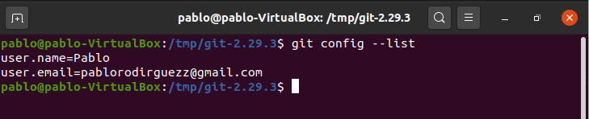

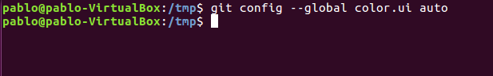

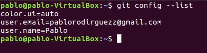

## Creación de un repositorio
Ahora crearemos un repositorio para ver su contenido para ello usaremos los siguientes comando: **“mkdir dpl”** para crear el repositorio de nombre dpl, **“cd dpl”** para acceder al repositorio,  **“git init”** para inicializar git en el repositorio actual y **“ls -la”** para mostrar el contenido del repositorio.

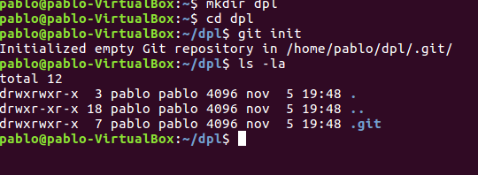

## Comprobar el estado del repositorio
Para comenzar con esta parte miraremos el estado del repositorio git con el comando **”git status”**.

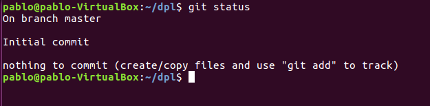

Crearemos un fichero con el comando **“cat > indice.txt”**.  Para terminar de editarlo seria **“Ctrl+D”**.

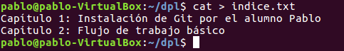

Tras la creación del fichero volvemos a ver el estado del repositorio con **“git status”**.

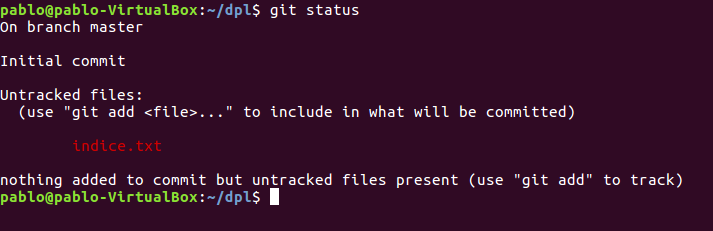

Después de esto lo añadiremos a la zona de intercambio temporal para luego poder subirla con el comando **“ git add indice.txt”**.

Finalmente veremos otra vez el estado del repositorio.

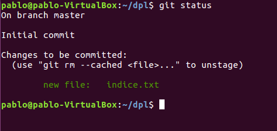

## Realizando Commits
A continuación, realizaremos un commit del repositorio  con un mensaje **“git commit -m "Añadido índice de la asignatura DPL."”**.

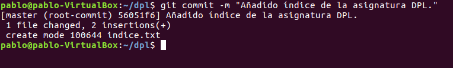

Tras esto revisaremos el estado del repositorio con **“git status”**.

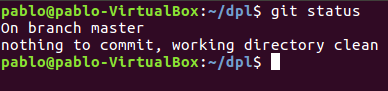

## Modificación de ficheros

Ahora el fichero indice.txt lo editaremos con el comando **“cat > indice.txt”**.

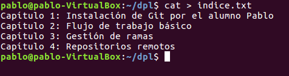

Para mostrar los cambios realizados en comparación al anterior fichero usaremos el comando **“git diff”**.

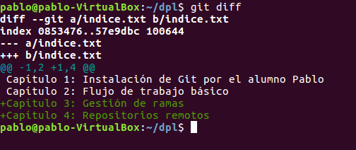

Añadimos a la zona de intercambio temporal el fichero con los nuevos cambios con el comando **“git add indice.txt”**.

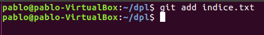

Finalmente hacemos un commit con el mensaje de que añadimos nuevos datos al fichero para ello usaremos el comando **“git commit -m "Añadido los capítulos 3"”**.

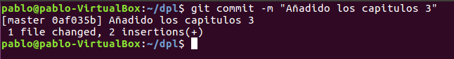

## Historial
En esta última parte de la actividad mostraremos los cambios entre las últimas versiones con el comando **“git show”**.

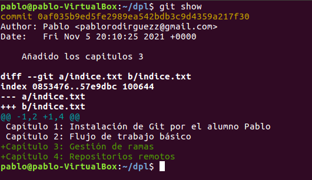

Ahora cambiaremos el mensaje del último commit con el siguiente comando **“git commit --amend -m "Añadido el capítulo sobre gestión de ramas al índice."”**.

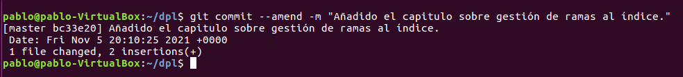

Finalmente volveremos a mostrar los cambios con el comando **“git show”**.

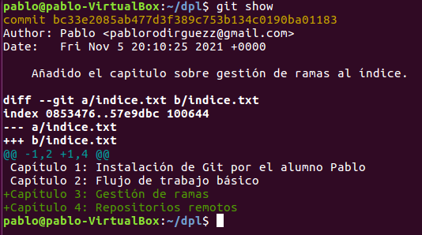

